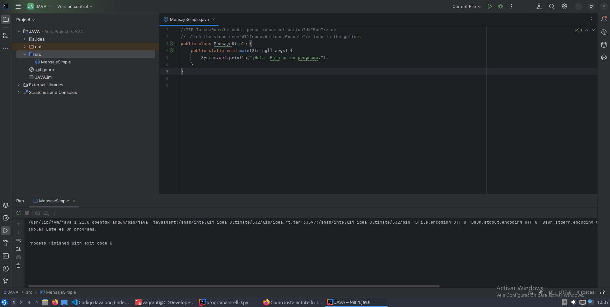

# IntelliJ IDEA

## Razones por las que escogí IntelliJ.

- Aparte de que es un IDE muy completo, es perfecto para los devs que buscan mejorar su flujo de trabajo gracioas a características como estas.

- Incluye función de autocompletado inteligente, refactorización avanzada y dispone de una excelente integración con herramientas de contrucción.

## Proceso de Instalacion del software.

### Fuentes

https://www.nubeclan.com/2017/09/como-instalar-intellij-idea-en-ubuntu.html

1. Actualizamos os repositorios:
        
        "sudo apt update"

2. Procedemos a instalar os paquetes do noso software:
        
        "sudo snap install intellij-idea-ultimate --classic"

 Tambien podriamos instalar a mayores la version edge se ejecutaria el mismo comando pero incluyendo el parametro --edge y quedaria tal que asi:
 
        
        "sudo snap install intellij-idea-ultimate --classic --edge".

3. Una vez el paquete esta instalado se puede ejecutar escribiendo el comando:

        "intellij-idea-ultimate".

## Creamos el codigo dentro del IDE
       
